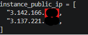

create an Ubuntu EC2 instance in AWS with Terraform, follow these steps:

## 1. Install Terraform on your device
- Go to https://developer.hashicorp.com/terraform/downloads and download the installer for your operating system.
- Follow the instructions on the site to install it.

## 2. Install and Configure the AWS CLI
-Terraform needs access to your AWS account.
- Go to https://aws.amazon.com/cli/ and download the AWS CLI installer.
- Run the installer and follow the instructions.
- Open a terminal and run:

```bash
aws configure
```
Enter:
- AWS Access Key ID
- AWS Secret Access Key
- Default region (e.g., us-east-1)
- Output format: json

## 3. Download the Terraform Project Folder
Open the folder with VS Code

Edit:
- main.tf → input your AWS account IAM ID
- variables.tf → adjust number of instances

## 4. Run Terraform Commands
```bash
terraform fmt
terraform init
terraform plan
terraform apply
```
## 5. Copy Your Instance IP Address
- output.tf will print the IP(s) in your terminal



## 6. Connect Using MobaXterm
- Download from https://mobaxterm.mobatek.net/
- Open → Click Session
- Select SSH
- Paste public IP
- Username: ubuntu
- Use your .pem key under advanced settings
